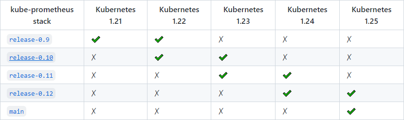

# Prometheus

[GitHub](https://github.com/prometheus-operator/kube-prometheus) [中文文档](https://www.prometheus.wang/quickstart/) [英文文档](https://prometheus.io/docs/introduction/overview/)

------

## 1. 架构


## 2. 安装



------

### 2.1 源码下载

```shell
version=release-0.11 && git clone -b $version https://github.com/prometheus-operator/kube-prometheus.git
```

------

### 2.2 镜像整理

```shell
cd kube-prometheus/manifests
vim bash.sh
...
chmod +x bash.sh

# 脚本说明
./bash.sh       # 镜像梳理并改成私有仓库地址
./bash.sh push  # 镜像推送至私有仓库
./bash.sh save  # 镜像保存至本地
./bash.sh tidy  # yaml 文件整理
./bash.sh apply # kubectl 部署
```

```shell
#!/usr/bin/env bash

registry="10.64.21.107:83"

# 统计镜像
collecting() {
  ls $1 | while read file; do
    if [[ -d $file ]]; then
      collecting $1/$file
    else
      if [[ ${file##*.} = "yaml" ]]; then
        cat $1/$file | grep "image: " | sed -s "s/.*image: //g" >> image.bak
        cat $1/$file | grep "prometheus-config-reloader=" | sed -s "s/.*prometheus-config-reloader=//g" >> image.bak
      fi
    fi
  done
}

# 镜像推送
push() {
  cat image.txt | while read line; do
    docker push $registry/$line
  done
}

# 镜像打包
save() {
  if [[ ! -e images ]]; then
    mkdir images
  fi

  cat image.txt | while read line; do
    if [[ $registry ]]; then
      line=$registry/$line
    fi

    filename=${line##*/}
    filename=${filename//:/_}

    docker save -o ./images/$filename.tar $line
  done
}

# yaml 整理
tidy() {
  dirs=(
    "alertmanager"
    "node-exporter"
    "blackbox-exporter"
    "kube-state-metrics"
    "prometheus-adapter"
    "grafana"
    "operator"
    "prometheus"
    "serviceMonitor"
  )

  for item in ${dirs[@]}; do
    if [[ ! -d $item ]]; then
      mkdir $item
    fi

    ls | grep ".yaml" | grep $item | while read file; do
      mv $file $item
    done
  done
}

# kubectl 部署
apply() {
  # setup(operator)
  if [[ ! -f setup/setup.lock ]]; then
    kubectl apply -f setup
    echo > setup/setup.lock
  else
    echo -e "\033[33mingore setup.\033[0m\c\n"
  fi

  # prometheus
  ls | grep -v "setup" | while read dir; do
    if [[ -d $dir ]] && [[ $(ls $dir) ]]; then
      kubectl apply -f $dir
    fi
  done
}

delete() {
  # prometheus
  ls | grep -v "setup" | while read dir; do
    if [[ -d $dir ]]; then
      kubectl delete -f $dir
    fi
  done
}

main() {
  collecting .

  # 镜像去重
  cat image.bak | sort | uniq > image.txt && rm -f image.bak

  # 镜像下载
  cat image.txt | while read line; do
    docker pull $line
    if [[ $registry ]]; then
      docker tag $line $registry/$line
    fi
  done

  echo
  if [[ $registry ]]; then
    echo -e "\033[36mComplete! Please replace the mirror registry to '$registry'.\033[0m\c"
  else
    echo -e "\033[36mComplete!.\033[0m\c"
  fi
  echo
}

case $1 in
  push)
  push
  ;;
  save)
  save
  ;;
  tidy)
  tidy
  ;;
  apply)
  apply
  ;;
  delete)
  delete
  ;;
  *)
  main
  ;;
esac

```

------

### 2.3 程序部署

```shell
# 若已部署 Kubesphere，请跳转至 '2.4.2'，在 Kubesphere 中集成 Prometheus，防止冲突。
```

------

#### 2.3.1 修改 yaml

##### 1. (pvc) grafana-deployment.yaml

```yaml
kind: StatefulSet
apiVersion: apps/v1
...
          volumeMounts:
            - mountPath: /var/lib/grafana
              name: grafana-storage
...
      volumes:
-       - emptyDir: {}
-         name: grafana-storage
...
  volumeClaimTemplates:
    - kind: PersistentVolumeClaim
      apiVersion: v1
      metadata:
        name: grafana-storage
      spec:
        accessModes:
          - ReadWriteOnce
        resources:
          requests:
            storage: 100Gi
        storageClassName: juicefs-sc
        volumeMode: Filesystem
  serviceName: grafana
```

##### 2. (pvc) prometheus-prometheus.yaml

```yaml
  version: 2.29.1
  storage:
    volumeClaimTemplate:
      spec:
        storageClassName: juicefs-sc
        resources:
          requests:
            storage: 100Gi
```

##### 3. (ing) prometheus-ingress.yaml

```yaml
apiVersion: networking.k8s.io/v1
kind: Ingress
metadata:
  name: prometheus-ingress
  namespace: monitoring
  annotations:
    kubernetes.io/ingress.class: "nginx"
spec:
  rules:
  - host: alert.com
    http:
      paths:
      - path: /
        pathType: Prefix
        backend:
          service:
            name: alertmanager-main
            port:
              number: 9093
  - host: grafana.com
    http:
      paths:
      - path: /
        pathType: Prefix
        backend:
          service:
            name: grafana
            port:
              number: 3000
  - host: prom.com
    http:
      paths:
      - path: /
        pathType: Prefix
        backend:
          service:
            name: prometheus-k8s
            port:
              number: 9090
```

------

#### 2.3.2 部署清单

```shell
# 详见 2.2 镜像整理
./bash.sh apply

# 主要组件
kubectl apply -f setup(operator)
kubectl apply -f prometheus
kubectl apply -f node-exporter
kubectl apply -f kube-state-metrics
```

```shell
# 将 Prometheus 规则评估间隔设置为 1m，与 KubeSphere 3.3.0 的自定义 ServiceMonitor 保持一致。规则评估间隔应大于或等于抓取间隔

kubectl -n monitoring patch prometheus k8s --patch '{
  "spec": {
    "evaluationInterval": "1m"
  }
}' --type=merge
```

------

#### 2.3.3 错误整理

##### 1. (wan) watchdog

```
watchdog 是一个正常的报警，这个告警的作用是：如果 alermanger 或者 prometheus 本身挂掉了就发不出告警了，因此一般会采用另一个监控来监控 prometheus，或者自定义一个持续不断的告警通知，哪一天这个告警通知不发了，说明监控出现问题了。prometheus operator 已经考虑了这一点，本身携带一个 watchdog，作为对自身的监控。
```

```yaml
# kube-prometheus-prometheusRule.yaml

...
    - alert: Watchdog
      annotations:
        description: |
          This is an alert meant to ensure that the entire alerting pipeline is functional.
          This alert is always firing, therefore it should always be firing in Alertmanager
          and always fire against a receiver. There are integrations with various notification
          mechanisms that send a notification when this alert is not firing. For example the
          "DeadMansSnitch" integration in PagerDuty.
        runbook_url: https://runbooks.prometheus-operator.dev/runbooks/general/watchdog
        summary: An alert that should always be firing to certify that Alertmanager is working properly.
      expr: vector(1)
      labels:
        severity: none
...
```

##### 2. (err) connection refused

- ###### [10257] kube-controller-manager

  ```shell
  file=/etc/kubernetes/manifests/kube-controller-manager.yaml
  sudo sh -c "sed -s -i 's/--bind-address=127.0.0.1/--bind-address=0.0.0.0/g' $file"
  ```

- ###### [10259] kube-scheduler

  ```shell
  file=/etc/kubernetes/manifests/kube-scheduler.yaml
  sudo sh -c "sed -s -i 's/--bind-address=127.0.0.1/--bind-address=0.0.0.0/g' $file"
  ```

------

### 2.4 Kubesphere

#### 2.4.1 未安装 Kubesphere

##### 1. 部署 Prometheus

```shell
# 详见 2.3 程序部署
./bash apply
```

##### 2. 集成 Kubesphere

```shell
vim cluster-configuration.yaml

...
    monitoring:
      endpoint: http://prometheus-operated.monitoring.svc:9090
...
```

------

#### 2.4.2 已安装 Kubesphere

```shell
# v3.3
# https://kubesphere.io/zh/docs/v3.3/faq/observability/byop/
```

##### 1. 卸载 kubesphere-prometheus

- ###### alertmanager

  ```shell
  kubectl -n kubesphere-system exec $(kubectl get pod -n kubesphere-system -l app=ks-installer -o jsonpath='{.items[0].metadata.name}') -- kubectl delete -f /kubesphere/kubesphere/prometheus/alertmanager/ 2>/dev/null
  ```

- ###### grafana

  ```shell
  kubectl -n kubesphere-system exec $(kubectl get pod -n kubesphere-system -l app=ks-installer -o jsonpath='{.items[0].metadata.name}') -- kubectl delete -f /kubesphere/kubesphere/prometheus/grafana/ 2>/dev/null
  ```

- ###### devops

  ```shell
  kubectl -n kubesphere-system exec $(kubectl get pod -n kubesphere-system -l app=ks-installer -o jsonpath='{.items[0].metadata.name}') -- kubectl delete -f /kubesphere/kubesphere/prometheus/devops/ 2>/dev/null
  ```

- ###### etcd

  ```shell
  kubectl -n kubesphere-system exec $(kubectl get pod -n kubesphere-system -l app=ks-installer -o jsonpath='{.items[0].metadata.name}') -- kubectl delete -f /kubesphere/kubesphere/prometheus/etcd/ 2>/dev/null
  ```

- ###### upgrade

  ```shell
  kubectl -n kubesphere-system exec $(kubectl get pod -n kubesphere-system -l app=ks-installer -o jsonpath='{.items[0].metadata.name}') -- kubectl delete -f /kubesphere/kubesphere/prometheus/upgrade/ 2>/dev/null
  ```

- ###### operator

  ```shell
  kubectl -n kubesphere-system exec $(kubectl get pod -n kubesphere-system -l app=ks-installer -o jsonpath='{.items[0].metadata.name}') -- kubectl delete -f /kubesphere/kubesphere/prometheus/prometheus-operator/ 2>/dev/null
  
  kebuctl -n kubesphere-monitoring-system delete svc prometheus-operated 2>/dev/null
  ```

- ###### kube-state-metrics

  ```shell
  kubectl -n kubesphere-system exec $(kubectl get pod -n kubesphere-system -l app=ks-installer -o jsonpath='{.items[0].metadata.name}') -- kubectl delete -f /kubesphere/kubesphere/prometheus/kube-state-metrics/ 2>/dev/null
  ```

- ###### node-exporter

  ```shell
  kubectl -n kubesphere-system exec $(kubectl get pod -n kubesphere-system -l app=ks-installer -o jsonpath='{.items[0].metadata.name}') -- kubectl delete -f /kubesphere/kubesphere/prometheus/node-exporter/ 2>/dev/null
  ```

- ###### prometheus

  ```shell
  kubectl -n kubesphere-system exec $(kubectl get pod -n kubesphere-system -l app=ks-installer -o jsonpath='{.items[0].metadata.name}') -- kubectl delete -f /kubesphere/kubesphere/prometheus/prometheus/ 2>/dev/null
  ```

- ###### pvc

  ```shell
  kubectl -n kubesphere-monitoring-system delete pvc $(kubectl -n kubesphere-monitoring-system get pvc | grep -v VOLUME | awk '{print$1}' | tr '\n' ' ')
  ```

##### 2. 部署 Prometheus

- ##### 官网安装

  ```shell
  # 详见 2.3 程序部署
  ./bash apply
  ```

- ##### Kubesphere 安装

  ```shell
  # v3.3
  git clone -b release-3.3 https://github.com/kubesphere/ks-installer.git && cd ks-installer/roles/ks-monitor/files/prometheus
  
  # 创建 kustomization.yaml
  cat > kustomization.yaml << EOF
  kind: Kustomization
  apiVersion: kustomize.config.k8s.io/v1beta1
  namespace: monitoring
  resources:
  EOF
  
  find . -mindepth 2 -name "*.yaml" -type f -print | sed 's/^/- /' >> kustomization.yaml
  
  # (可选) 移除不必要的组件
  sed -i '/grafana\//d' kustomization.yaml
  
  # 部署
  kubectl apply -k .
  ```

##### 3. 集成 Prometheus

```shell
kubectl edit cm -n kubesphere-system kubesphere-config

...
    monitoring:
      endpoint: http://prometheus-operated.monitoring.svc:9090
...
```

